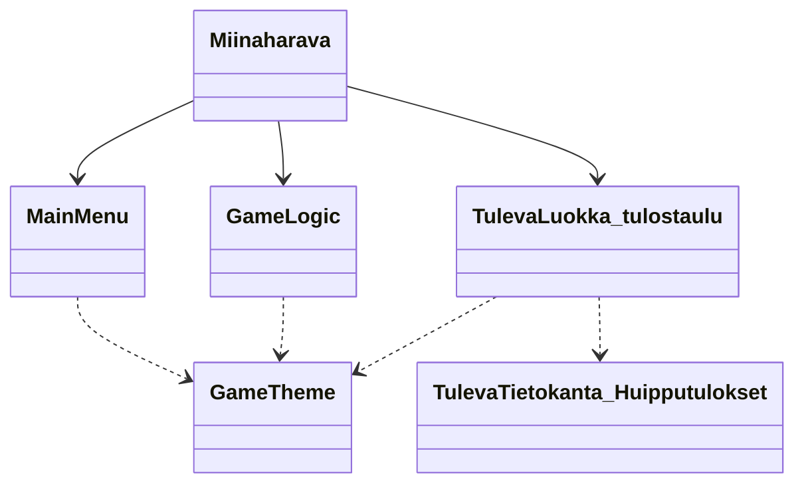
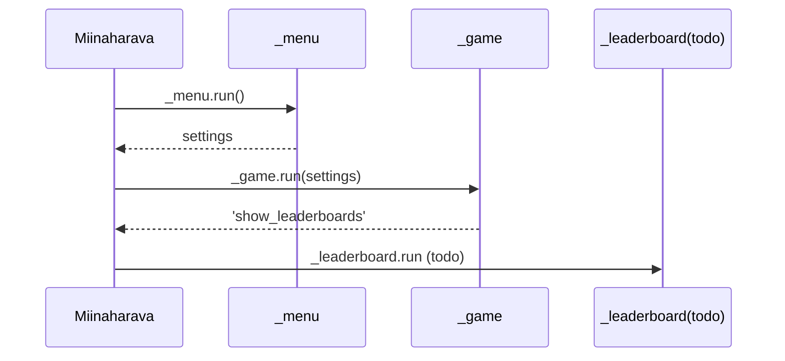

# Arkkitehtuurikuvaus  
## Luokkakuvaus
Alustava kuvaus sovelluksen luokista. Tuleva-alkuisia luokkia ei ole vielä luotu  

```mermaid
classDiagram
    class Miinaharava
    class MainMenu
    class GameTheme

    Miinaharava --> MainMenu
    MainMenu ..> GameTheme
    Miinaharava --> GameLogic
    GameLogic ..> GameTheme
    TulevaLuokka_tulostaulu ..> GameTheme
    TulevaLuokka_tulostaulu ..> TulevaTietokanta_Huipputulokset
    Miinaharava --> TulevaLuokka_tulostaulu
```

## Sekvenssikaaviot

### Sekvenssikaavio yksittäisen pelin kulusta

```mermaid
sequenceDiagram
participant Miinaharava
participant _menu
Miinaharava->>_menu: _menu.run()
_menu-->> Miinaharava:settings
Miinaharava->>_game:  _game.run(settings) 

_game-->>Miinaharava: 'show_leaderboards'
Miinaharava->>_leaderboard(todo):  _leaderboard.run (todo)
```

