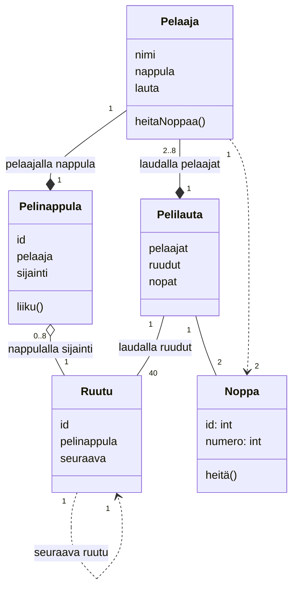

```mermaid
classDiagram
    class Noppa{
        id: int
        numero: int
        heitä()
    }
    class Pelaaja{
        nimi
        nappula
        lauta
        heitaNoppaa()
    }
    class Pelilauta{
        pelaajat
        ruudut
        nopat
    }
    class Ruutu{
        id
        pelinappula
        seuraava
    }
    class Pelinappula{
        id
        pelaaja
        sijainti
        liiku()
    }

    Pelaaja "1" --* "1" Pelinappula : pelaajalla nappula
    Pelinappula "0..8" o-- "1" Ruutu : nappulalla sijainti
    Ruutu "1" ..>  "1" Ruutu : seuraava ruutu
    Pelaaja "2..8" --* "1" Pelilauta : laudalla pelaajat
    Pelilauta "1" -- "40"Ruutu : laudalla ruudut
    Pelilauta "1" -- "2" Noppa
    Pelaaja "1" ..> "2" Noppa
```