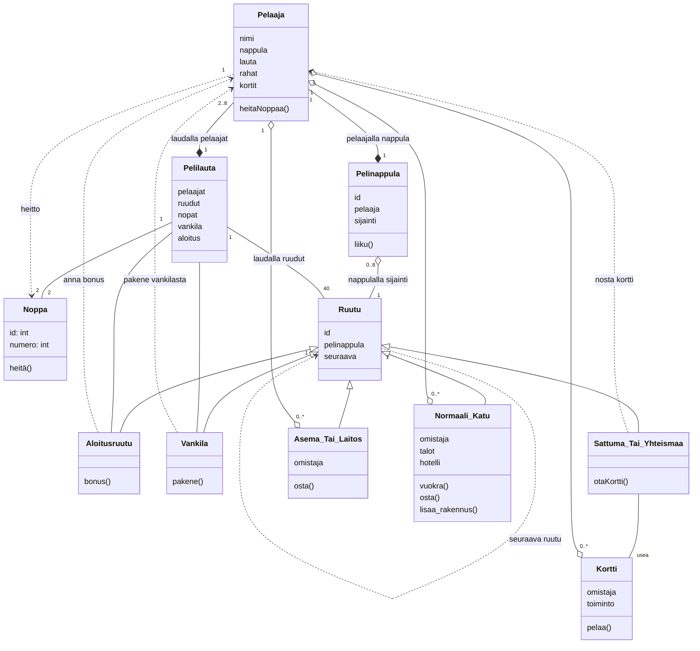

```mermaid
classDiagram
    class Noppa{
        id: int
        numero: int
        heitä()
    }
    class Pelaaja{
        nimi
        nappula
        lauta
        rahat
        kortit
        heitaNoppaa()
    }
    class Pelilauta{
        pelaajat
        ruudut
        nopat
        vankila
        aloitus
    }
    class Ruutu{
        id
        pelinappula
        seuraava
    }
    class Pelinappula{
        id
        pelaaja
        sijainti
        liiku()
    }
    class Aloitusruutu{
        bonus()
    }
    class Vankila{
        pakene()
    }
    class Sattuma_Tai_Yhteismaa{
        otaKortti()
    }
    class Asema_Tai_Laitos{
        osta()
        omistaja
    }
    class Normaali_Katu{
        vuokra()
        osta()
        omistaja
        talot
        hotelli
        lisaa_rakennus()
    }
    class Kortti{
        omistaja
        toiminto
        pelaa()
    }


    Pelaaja "1" --* "1" Pelinappula : pelaajalla nappula
    Pelinappula "0..8" o-- "1" Ruutu : nappulalla sijainti
    Ruutu "1" ..>  "1" Ruutu : seuraava ruutu
    Pelaaja "2..8" --* "1" Pelilauta : laudalla pelaajat
    Pelilauta "1" -- "40"Ruutu : laudalla ruudut
    Pelilauta "1" -- "2" Noppa
    Pelaaja "1" ..> "2" Noppa : heitto
    Ruutu <|-- Aloitusruutu
    Ruutu <|-- Sattuma_Tai_Yhteismaa
    Ruutu <|-- Vankila
    Ruutu <|-- Asema_Tai_Laitos
    Ruutu <|-- Normaali_Katu
    Pelilauta -- Vankila
    Pelilauta -- Aloitusruutu
    Aloitusruutu ..> Pelaaja : anna bonus
    Vankila ..> Pelaaja : pakene vankilasta
    Sattuma_Tai_Yhteismaa ..> Pelaaja : nosta kortti
    Normaali_Katu"0..*" o--o "1"Pelaaja 
    Asema_Tai_Laitos"0..*" o--o "1"Pelaaja
    Sattuma_Tai_Yhteismaa -- "usea" Kortti
    Kortti"0..*" o--o "1"Pelaaja
```
