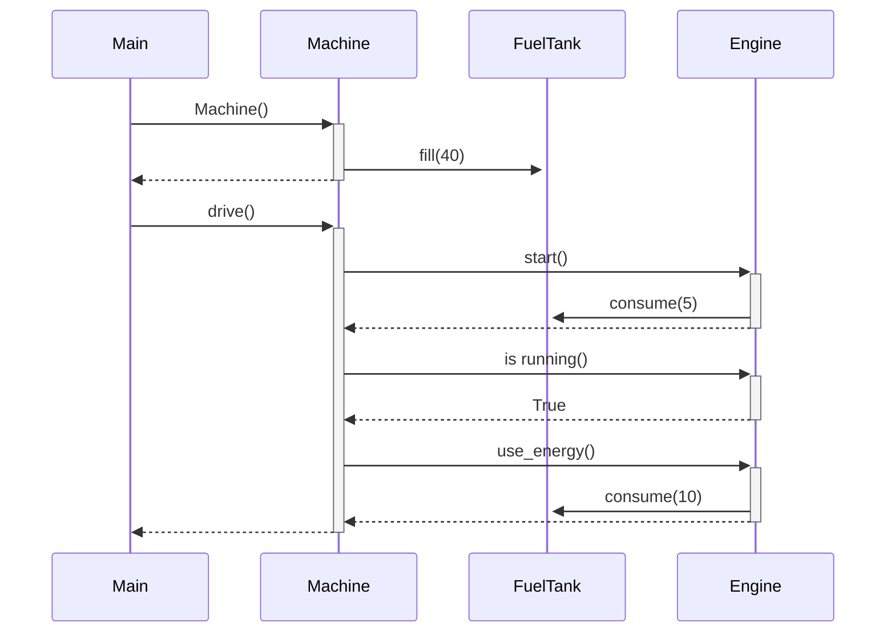

```mermaid
sequenceDiagram
    participant Main
    participant Machine
    participant FuelTank  
    participant Engine
    Main ->>+ Machine: Machine()
    Machine ->>+ FuelTank: fill(40)
    Machine -->>- Main: 
    Main ->>+ Machine: drive()
    Machine ->>+ Engine: start()
    Engine ->> FuelTank: consume(5)
    Engine -->>- Machine: 
    Machine ->>+ Engine: is running()
    Engine -->>- Machine: True
    Machine ->>+ Engine: use_energy()
    Engine ->> FuelTank: consume(10)
    Engine -->>- Machine: 
    Machine -->>- Main: 
```