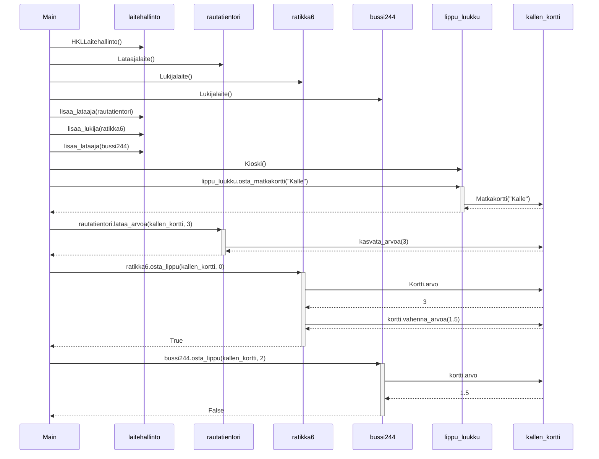

```mermaid
sequenceDiagram
    Main ->> laitehallinto: HKLLaitehallinto()
    Main ->> rautatientori: Lataajalaite()
    Main ->> ratikka6: Lukijalaite()
    Main ->> bussi244: Lukijalaite()
    Main ->> laitehallinto: lisaa_lataaja(rautatientori)
    Main ->> laitehallinto: lisaa_lukija(ratikka6)
    Main ->> laitehallinto: lisaa_lataaja(bussi244)
    Main ->> lippu_luukku: Kioski()
    Main ->>+ lippu_luukku: lippu_luukku.osta_matkakortti("Kalle")
    lippu_luukku ->> kallen_kortti: Matkakortti("Kalle")
    kallen_kortti -->> lippu_luukku: 
    lippu_luukku -->>- Main: 
    Main ->>+ rautatientori: rautatientori.lataa_arvoa(kallen_kortti, 3)
    rautatientori ->> kallen_kortti: kasvata_arvoa(3)
    kallen_kortti -->> rautatientori: 
    rautatientori -->>- Main: 
    Main ->>+ ratikka6: ratikka6.osta_lippu(kallen_kortti, 0)
    ratikka6 ->> kallen_kortti: Kortti.arvo
    kallen_kortti -->> ratikka6: 3
    ratikka6 ->> kallen_kortti: kortti.vahenna_arvoa(1.5)
    kallen_kortti -->> ratikka6: 
    ratikka6 -->>- Main: True
    Main ->>+ bussi244: bussi244.osta_lippu(kallen_kortti, 2)
    bussi244 ->> kallen_kortti: kortti.arvo
    kallen_kortti -->> bussi244: 1.5
    bussi244 -->>- Main: False
```